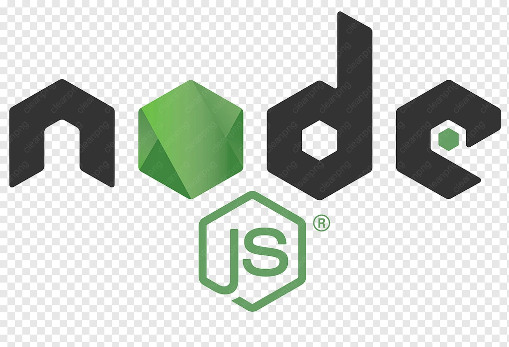
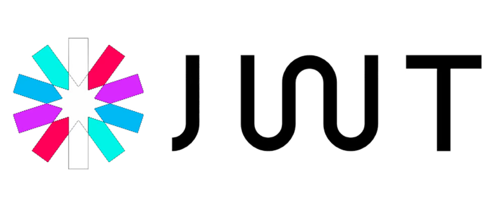
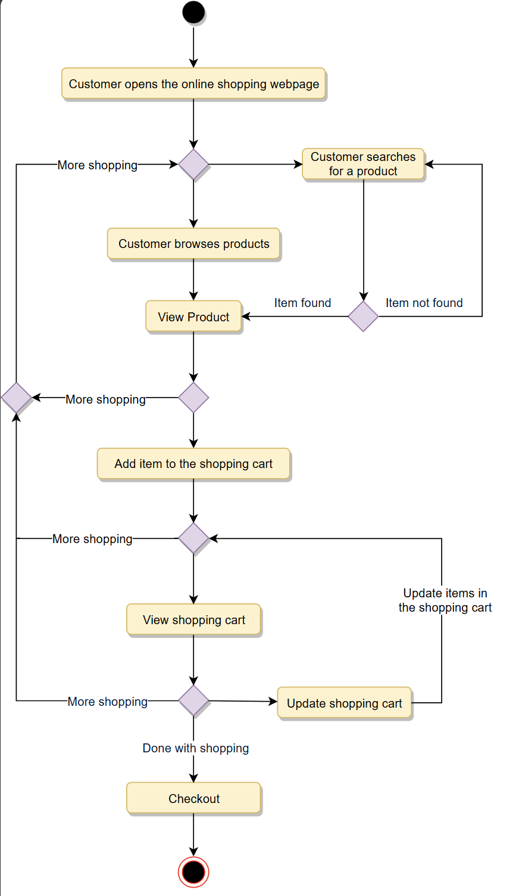
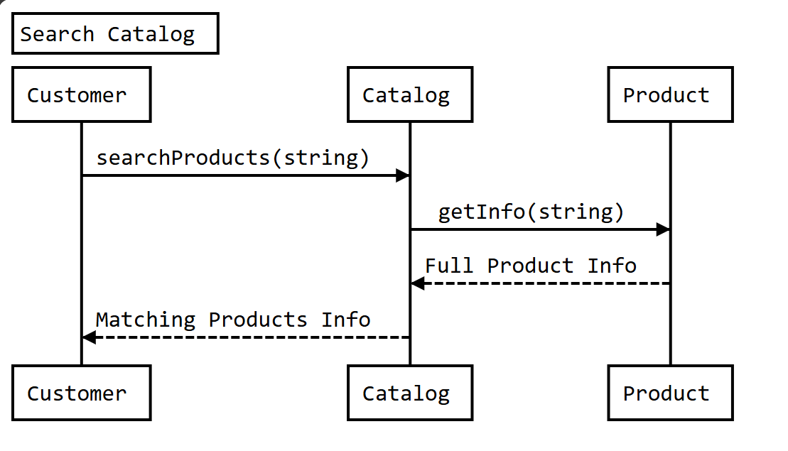
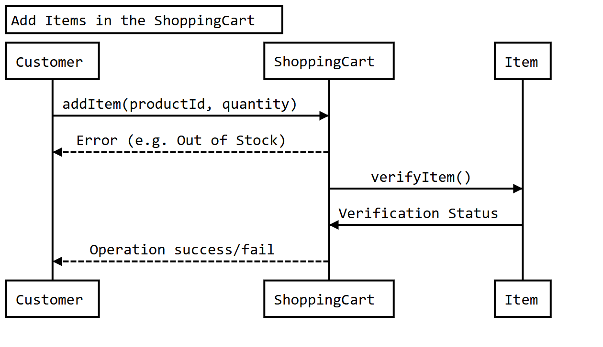
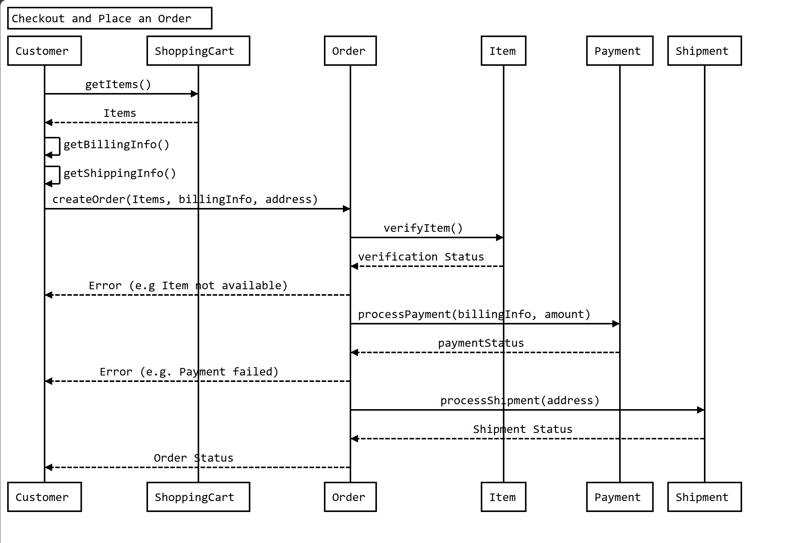

# 🛒 MERN eCommerce Platform

A full-stack **eCommerce web application** built using the **MERN stack** (MongoDB, Express.js, React.js, Node.js), providing a seamless online shopping experience with secure authentication, product management, shopping cart, and order processing.

---

## 📌 Table of Contents

- [Overview](#overview)
- [Features](#features)
- [Tech Stack](#tech-stack)
- [UML Diagrams](#uml-diagrams)
- [Folder Structure](#folder-structure)
- [Getting Started](#getting-started)
- [Author](#author)

---

## 📸 Overview

This project simulates a real-world eCommerce platform, featuring:

- Customer registration and login
- Admin dashboard for product management
- Cart and wishlist functionality
- Order and checkout process
- Responsive design for all devices

---

## ✨ Features

- 👤 User authentication (JWT-based)
- 🛍️ Product listing, details, and categories
- 🛒 Cart and wishlist management
- 💳 Payment gateway integration (Stripe/PayPal)
- 📦 Order history and tracking
- 🔐 Admin panel (Add/Edit/Delete products)
- 📱 Fully responsive UI

---

### 🚀 Tech Stack

- **Frontend**:  React,  Tailwind CSS/ Bootstrap
- **Backend**:  Node.js,  Redux,  Express
- **Database**:  MongoDB
- **Authentication**:  JWT

### System Requirements

We will be designing a system with the following requirements:

1. Users should be able to add new products to sell.
2. Users should be able to search for products by their name or category.
3. Users can search and view all the products, but they will have to become a registered member to buy a product.
4. Users should be able to add/remove/modify product items in their shopping cart.
5. Users can check out and buy items in the shopping cart.
6. Users can rate and add a review for a product.
7. The user should be able to specify a shipping address where their order will be delivered.
8. Users can cancel an order if it has not shipped.
9. Users should get notifications whenever there is a change in the order or shipping status.
10. Users should be able to pay through credit cards or electronic bank transfer.
11. Users should be able to track their shipment to see the current state of their order.

### Use Case Diagram

We have four main Actors in our system:

* **Admin:** Mainly responsible for account management and adding or modifying new product categories.
* **Guest:** All guests can search the catalog, add/remove items to the shopping cart, as well as become registered members.
* **Member:** Members can perform all the activities that guests can, in addition to which, they can place orders and add new products to sell.
* **System:** Mainly responsible for sending notifications for orders and shipping updates.

Here are the top use cases of the Online Shopping System:

1. Add/update products; whenever a product is added or modified, we will update the catalog.
2. Search for products by their name or category.
3. Add/remove product items in the shopping cart.
4. Check-out to buy product items in the shopping cart.
5. Make a payment to place an order.
6. Add a new product category.
7. Send notifications to members with shipment updates.

Here is the use case diagram of our Online Shopping System:

<p align="center">
    
    <br />
    Use Case Diagram for Online Shoopping System
</p>

### Class Diagram

Here are the descriptions of the different classes of our Online Shopping System:

* **Account:** There are two types of registered accounts in the system: one will be an Admin, who is responsible for adding new product categories and blocking/unblocking members; the other, a Member, who can buy/sell products.
* **Guest:** Guests can search for and view products, and add them in the shopping cart. To place an order they have to become a registered member.
* **Catalog:** Users of our system can search for products by their name or category. This class will keep an index of all products for faster search.
* **ProductCategory:** This will encapsulate the different categories of products, such as books, electronics, etc.
* **Product:** This class will encapsulate the entity that the users of our system will be buying and selling. Each Product will belong to a ProductCategory.
* **ProductReview:** Any registered member can add a review about a product.
* **ShoppingCart:** Users will add product items that they intend to buy to the shopping cart.
* **Item:** This class will encapsulate a product item that the users will be buying or placing in the shopping cart. For example, a pen could be a product and if there are 10 pens in the inventory, each of these 10 pens will be considered a product item.
* **Order**: This will encapsulate a buying order to buy everything in the shopping cart.
* **OrderLog:** Will keep a track of the status of orders, such as unshipped, pending, complete, canceled, etc.
* **ShipmentLog:** Will keep a track of the status of shipments, such as pending, shipped, delivered, etc.
* **Notification:** This class will take care of sending notifications to customers.
* **Payment:** This class will encapsulate the payment for an order. Members can pay through credit card or electronic bank transfer.

<p align="center">
    
    <br />
    Class Diagram for Online Shoopping System
</p>


---

### 🔄 Activity Diagram



---

### 📈 Sequence Diagram

1. Here is the sequence diagram for searching from the catalog:

<p align="center">
    
    <br />
    Sequence Diagram for Online Shoopping System
</p>

2. Here is the sequence diagram for adding an item to the shopping cart:

<p align="center">
    
    <br />
    Sequence Diagram for Online Shoopping System
</p>

3. Here is the sequence diagram for checking out to place an order:

<p align="center">
    
    <br />
    Sequence Diagram for Online Shoopping System
</p>

---

Configuration
   1. Create a `.env` file in the `server` folder.
   2. Add the following environments varialbes to the `.env` file. Replace placeholders with your actual credentials:
   ```env
   MONGO_URI=your_mongodb_uri
   PORT=5000
   JWT_SECRET=your_jwt_secret
   FRONT_END_URL=http://localhost:3000
   CLOUDINARY_KEY=your_cloudinary_key
   CLOUDINARY_SECRET=your_cloudinary_secret
   CLOUD_NAME=your_cloudinary_cloud_name
   ```
   3. Configure the Spotify, Genius and Cloudinary credentials:
      - **Cloudinary:** Create an account to obtain your **`CLOUDINARY_KEY`** **`CLOUDINARY_SECRET`**, and **`CLOUD_NAME`**.

## Running the Application

1. Start the backend server:
   ```bash
   cd server
   npm run dev
   ```
2. Start the frontend application:
   ```bash
   cd client
   npm run dev
   ```

## Testing

- Ensure all environment variables are correctly set.
- Verify the functionality of each feature listed in the Features section.

