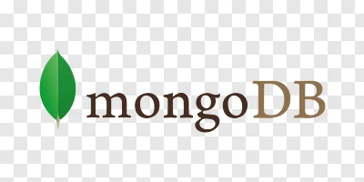
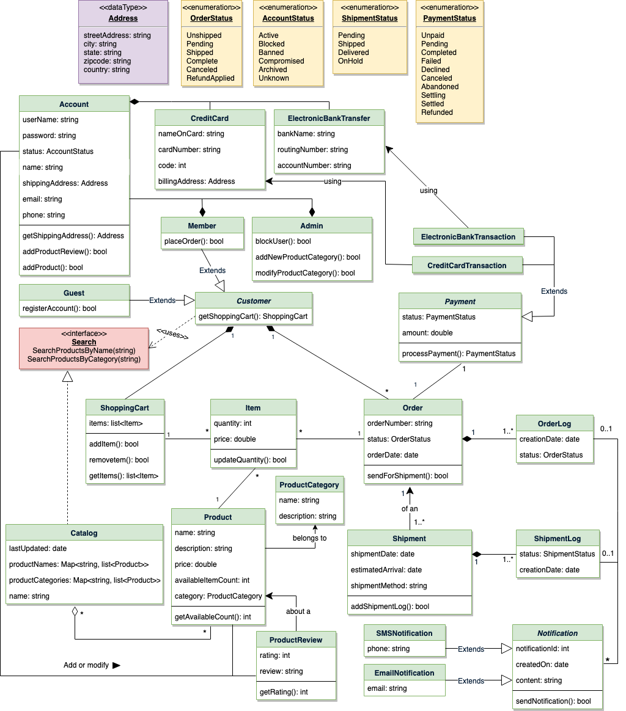

# 🛒 MERN eCommerce Platform

A full-stack **eCommerce web application** built using the **MERN stack** (MongoDB, Express.js, React.js, Node.js), providing a seamless online shopping experience with secure authentication, product management, shopping cart, and order processing.

---

## 📌 Table of Contents

- [Overview](#overview)
- [Features](#features)
- [Tech Stack](#tech-stack)
- [UML Diagrams](#uml-diagrams)
- [Folder Structure](#folder-structure)
- [Getting Started](#getting-started)
- [Author](#author)

---

## 📸 Overview

This project simulates a real-world eCommerce platform, featuring:

- Customer registration and login
- Admin dashboard for product management
- Cart and wishlist functionality
- Order and checkout process
- Responsive design for all devices

---

## ✨ Features

- 👤 User authentication (JWT-based)
- 🛍️ Product listing, details, and categories
- 🛒 Cart and wishlist management
- 💳 Payment gateway integration (Stripe/PayPal)
- 📦 Order history and tracking
- 🔐 Admin panel (Add/Edit/Delete products)
- 📱 Fully responsive UI

---

### 🚀 Tech Stack

#### 🔹 **Frontend**

- **React.js**  

- **Redux Toolkit**   

- **Tailwind CSS / Bootstrap**   

---

#### 🔹 **Backend**

- **Node.js**  

- **Express.js** 

- **MongoDB**  

- **JWT Authentication** 

---

## 📊 UML Diagrams

### ✅ Use Case Diagram

---

### 🧱 Class Diagram

---

### 🔄 Activity Diagram

---

### 📈 Sequence Diagrams

#### 1. User Login

#### 2. Product Purchase

#### 3. Admin Product Management

---

## 📁 Folder Structure (Basic Overview)

